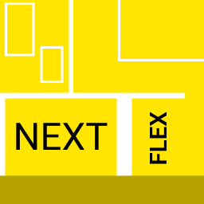

	

<h1>NEXTFLEX 🌆</h1>

It is Sass mixin kit and do your HTML/CSS layout most fasted, then bootstrap grid. NextFlex load only thoose styles, when you need.

<h2>HOW TO USE IT?</h2>

You must to know, what is Sass predprocessor and able use it - <a href="https://sass-lang.com/documentation/">see documentation</a>

NextFlex based on mixins, so we will be include code in our Sass file:

<pre>
@import path/to/nextflex

@include mixin_name(attr)
</pre>